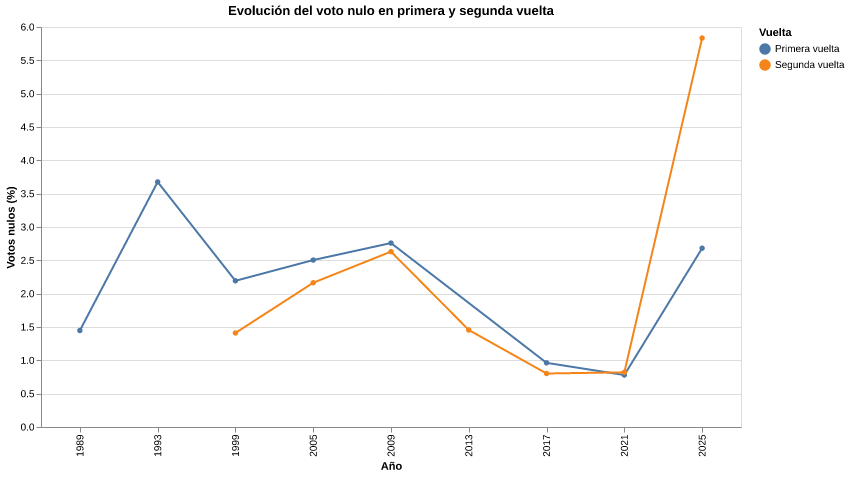

# Proceso

Primero le pedí a ChatGPT que me mostrara distintas ideas de wireframe para ordenar la página. Después elegí una estructura que permitiera mostrar de forma clara el título, la crónica, los gráficos y la metodología.

Luego revisé que la página cumpliera con los requisitos de la tarea, como usar títulos, párrafos, imágenes, enlaces, listas, divisiones, encabezado y pie de página.

Después le pedí a ChatGPT que creara el código HTML. Finalmente, revisé el código y corregí de forma manual algunos detalles que faltaban, como agregar un enlace externo.
Proceso

Primero le pedí a ChatGPT que me mostrara distintas ideas de wireframe para ordenar la página. Después elegí una estructura que permitiera mostrar de forma clara el título, la crónica, los gráficos y la metodología.

Luego revisé que la página cumpliera con los requisitos de la tarea. Después le pedí a ChatGPT que creara el código HTML y finalmente corregí de forma manual algunos detalles, como agregar un enlace externo.

Etiquetas utilizadas

Estructura básica

Usé la estructura principal de un documento HTML:

<!DOCTYPE html>
<html lang="es">
<head>
  <meta charset="UTF-8">
  <title>Evolución del voto nulo en Chile</title>
</head>
<body>
  Contenido de la página
</body>
</html>

Metadatos

Dentro de la etiqueta <head> agregué información sobre la página:

<meta charset="UTF-8">
<meta name="author" content="Erick Liu">
<meta
  name="description"
  content="Narración gráfica sobre la evolución del voto nulo en Chile."
>

Encabezado

Usé <header> para agrupar el inicio de la página:

<header>
  <h1>El voto que no elige presidente</h1>
  

    Evolución del voto nulo en las elecciones presidenciales chilenas.
  

</header>

Títulos y párrafos

Para organizar la crónica utilicé títulos y párrafos:

<h2>Una trayectoria lejos de ser estable</h2>

  El voto nulo no se comporta de la misma forma en todas las elecciones.

Divisiones

Usé 
 para agrupar elementos relacionados:

  
3,7% de votos nulos en 1993.

Imágenes

Las visualizaciones fueron agregadas con la etiqueta :

Lista

En la metodología utilicé una lista no ordenada:

<ul>
  <li>Periodo estudiado: 1989–2025.</li>
  <li>Fuente principal: Servicio Electoral de Chile.</li>
  <li>Unidad de análisis: elección presidencial.</li>
</ul>

Enlace externo

Agregué un enlace hacia el sitio del Servicio Electoral de Chile:

<a
  href="https://www.servel.cl/"
  target="_blank"
  rel="noopener noreferrer"
>
  Sitio oficial del Servicio Electoral de Chile
</a>

Clases e identificadores

Usé clases e identificadores para reconocer las distintas partes de la página:

<section class="article-section" id="historia">
  <h2>Una trayectoria lejos de ser estable</h2>
</section>

Pie de página

Al final de la página utilicé la etiqueta <footer>:

<footer>
  

    Narración gráfica desarrollada para un proyecto de periodismo de datos.
  

</footer>

https://liuerick.github.io/Tarea_03/#historia
