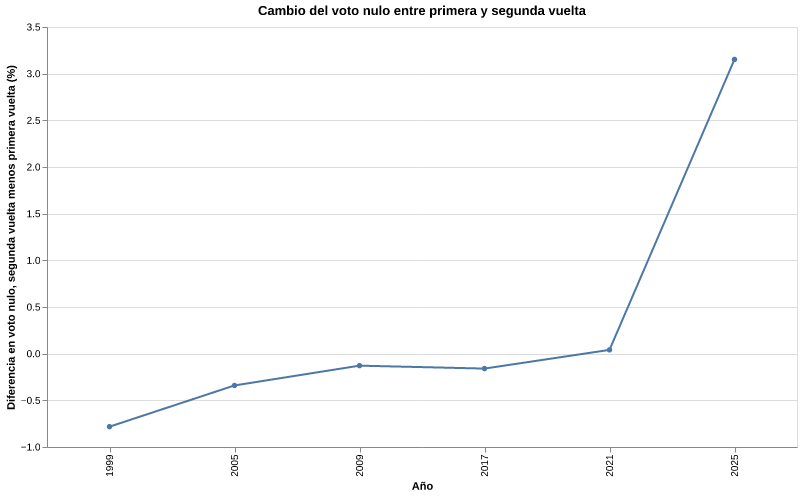

# Evolución del voto nulo en elecciones presidenciales chilenas

## Crónica

El voto nulo no se comporta igual en todas las elecciones presidenciales chilenas. Al mirar de manera histórica, aparecen momentos de estabilidad, bajas importantes y también aumentos muy marcados. Los siguentes gráficos permiten observar cómo ha cambiado el porcentaje de votos nulos entre 1989 y 2025, diferenciando principalmente entre primera y segunda vuelta.

Uno de los primeros datos a destacar es 1993. En esa elección, el voto nulo llega a uno de sus puntos más altos, con cerca de 3,7% en primera vuelta. Luego, en 1999, bajó con fuerza. Esto muestra que el voto nulo no dependió de que existían muchos candidatos, porque en ambos años hubo seis candidaturas en primera vuelta, pero el comportamiento del voto nulo fue distinto.

Entre 2005 y 2009, el voto nulo vuelve a moverse en niveles medios, cercanos al 2,5% y 2,8% en primera vuelta. Sin embargo, desde 2017 se observa una caída importante. En 2017 y 2021, los votos nulos se ubican bajo el 1% en primera vuelta. El cambio más fuerte aparece en 2025. En esa elección, el voto nulo sube de forma clara. En primera vuelta llega a cerca de 2,7%, pero en segunda vuelta alcanza casi 6%. Este salto es el dato más importante de la visualización, porque rompe con la tendencia baja que se venía observando desde 2017.

Este aumento debe considerar dos factores. El primero es el voto obligatorio. Cuando votar pasa a ser obligatorio, participan también personas que no se sienten representadas por ninguna candidatura. El segundo factor es la polarización. En la última elección incluida en la base, la segunda vuelta enfrentó a dos candidaturas ubicadas en polos extremedamante opuestos: una vinculada al Partido Comunista y otra al Partido Republicano. Esto permite pensar que el aumento del voto nulo no se explica solo por la obligación de votar, sino también por el tipo de alternativas disponibles. 

En 2017 y 2025 hubo una alta cantidad de candidatos en primera vuelta, pero el voto nulo fue muy distinto. En 2017 se mantiene bajo, mientras que en 2025 sube con fuerza. Esto refuerza que no es tan relevante cuantas candidaturas existen para la primer vuelta.

La comparación entre primera y segunda vuelta marca un cambio de tendecia claro en el voto nulo, que no se veió entre 1989 y 1999. En una primera vuelta, el elector tiene más opciones. En una segunda vuelta, la elección se reduce a dos alternativas. Cuando esas dos opciones son percibidas como muy lejanas o muy polarizadas, el voto nulo puede transformarse en una señal de malestar.

El cruce de datos no demuestra una causa directa, pero sí permite identificar una tendencia relevante: el voto nulo aumenta con fuerza en el escenario donde coinciden voto obligatorio, reducción de alternativas y alta polarización política. Por eso, más que tratarlo como un dato más, el voto nulo puede leerse como una pista sobre la distancia entre una parte del electorado y la oferta presidencial.

